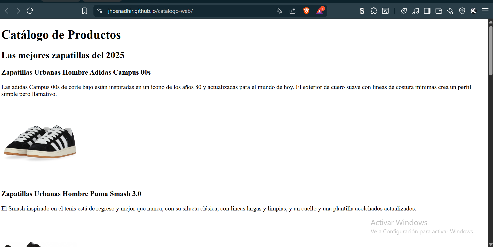

# Catálogo web - Documentación básica
Este proyecto es un pequeño catálogo web para el nivel Code 101 - Elementals.
## Lenguajes aprendidos 
- HTML
- CSS
- MARKDOWN

# Bitácora Técnica
Documentaré las etiquetas HTML y propiedades CSS que más han servido o gustado:

## Etiquetas HTML semánticas:
- h1,h2,p
- div, nav, header, footer, main, section
- img, href

## Propiedades de CSS:
- color, background color, font family
- width, height
- display, padding, margin, border

